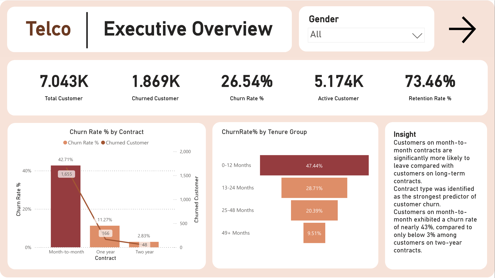
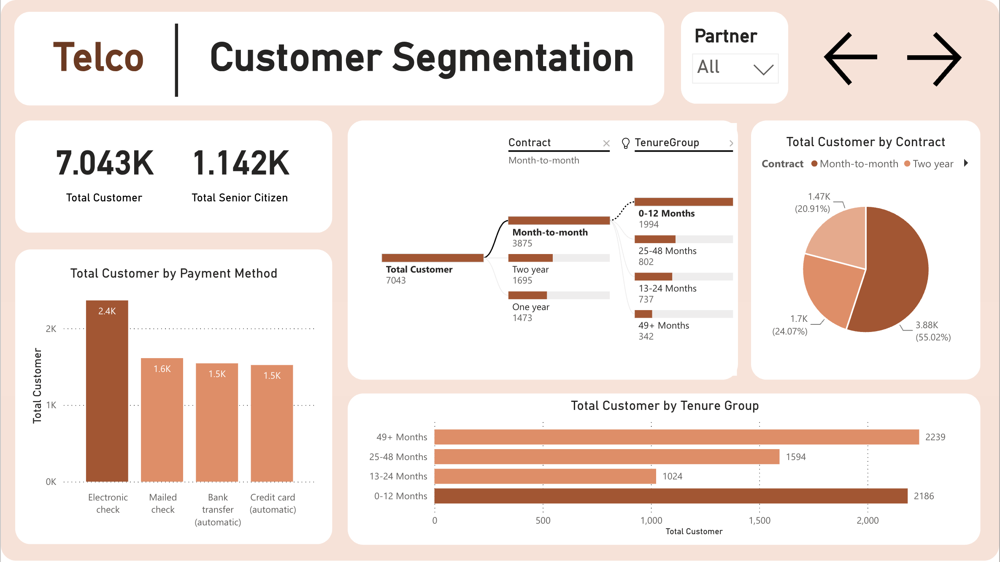
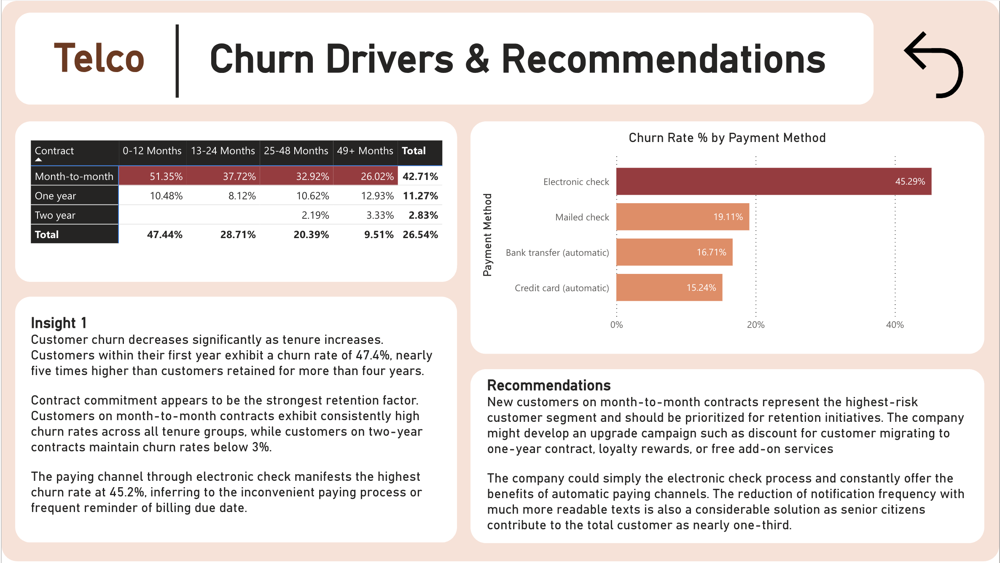

# Customer Churn Analysis
### Telco | SQL | Power BI | DAX | Excel | Python

## 1. Overview
Analyzed Telco customer data to identify the main drivers of churn, segment high-risk customer groups, and develop retention recommendations based on contract type, tenure, service usage, and payment behavior.

---

## 2. Business Problem
Customer churn is one of the most important challenges for subscription-based businesses because losing existing customers increases acquisition pressure and reduces long-term revenue.

This project was designed to answer the following stakeholder questions:

- How many customers are churning, and what is the overall churn rate?
- Which customer segments are most likely to churn?
- Does churn vary by contract type and customer tenure?
- Are service-related factors such as internet type, tech support, and billing behavior associated with churn?
- What actions should the business prioritize to improve customer retention?

---

## 3. Tools & Process

### SQL
- Cleaned and validated the Telco churn dataset, including checking missing values and customer-level consistency
- Built KPI summaries for total customers, churned customers, churn rate, average monthly charge, average total charge, and average tenure
- Analyzed churn by contract type, tenure group, internet service, tech support, payment method, and paperless billing
- Combined contract and tenure segments to identify the highest-risk customer groups
- Prepared aggregated outputs to support dashboard storytelling and retention recommendations

### Python
- Used for basic data inspection before analysis, including checking table structure, data types, missing values, duplicates, and summary statistics

### Power BI
- Built an interactive churn dashboard to monitor churn KPIs and compare customer risk across different segments
- Created visuals to analyze churn by contract, tenure, payment behavior, and customer profile
- Used segmentation analysis to highlight the strongest churn drivers and support retention-focused recommendations
- Designed dashboard pages to move from executive churn monitoring into root-cause analysis

---

## 4. Key Findings

- The dataset contains **7,043 customers**, of which **1,869 customers churned**, resulting in an overall **churn rate of 26.54%**.
- Churn declines sharply as customer tenure increases. Customers in their first year (**0–12 months**) had a **47.44% churn rate**, compared with only **9.51%** among customers retained for **49+ months**.
- **Contract type was the strongest retention factor**. Customers on **month-to-month contracts** had a churn rate of **42.71%**, compared with **11.27%** for **one-year contracts** and just **2.83%** for **two-year contracts**.
- The highest-risk segment was **month-to-month customers in their first year**, who showed the highest churn concentration across the portfolio.
- Customers using **Fiber optic internet** had the highest churn rate at **41.89%**, more than double the rate of **DSL customers (18.96%)** and far above customers with **no internet service (7.40%)**.
- Customers **without Tech Support** had a churn rate of **41.64%**, compared with **15.17%** for customers who had Tech Support, suggesting that support-related services may play an important role in retention.
- **Electronic check** users had the highest churn rate at **45.29%**, compared with **15–19%** for automatic bank transfer, credit card, and mailed check customers.
- Customers enrolled in **paperless billing** churned at **33.57%**, compared with **16.33%** for customers not using paperless billing, indicating that billing experience and payment behavior may be linked to churn risk.

---

## 5. Dashboard Preview

Explore the live Power BI dashboard here:

[Open Interactive Power BI Dashboard](https://app.powerbi.com/reportEmbed?reportId=e4896152-d157-40f0-995d-5580bbd4607c&autoAuth=true&ctid=fe3fbfc3-740c-40d3-a502-14423e1ca052&actionBarEnabled=true)

### 1) Executive Overview


---

### 2) Customer Segmentation


---

### 3) Churn Drivers & Recommendations


---

## 6. Recommendations

### 1) Prioritize retention for new month-to-month customers
Customers on **month-to-month contracts** with **0–12 months of tenure** represent the highest-risk segment in the business. The company should create an early-retention program targeting these customers within their first year, such as:
- onboarding support during the first 90 days
- proactive service check-ins
- targeted retention offers before renewal risk increases

### 2) Encourage migration from month-to-month to longer-term contracts
Since churn drops significantly for **one-year** and **two-year** customers, the company should test incentives that encourage contract conversion, such as:
- discounts for annual plans
- bundled benefits for long-term contracts
- loyalty rewards tied to contract upgrades

### 3) Investigate the churn experience of Fiber optic customers
Fiber optic customers had the highest churn rate in the dataset. This may suggest issues related to:
- service quality expectations
- pricing relative to perceived value
- onboarding or technical support experience

The business should investigate whether churn in this group is being driven by pricing, service dissatisfaction, or a mismatch between package design and customer expectations.

### 4) Expand Tech Support adoption among high-risk customers
Customers without Tech Support churned at a much higher rate than those who had it. The company should test whether offering Tech Support to new or high-risk customers improves retention, especially for:
- month-to-month customers
- Fiber optic users
- customers within their first 12 months

### 5) Review the payment journey for Electronic Check customers
Electronic check customers had by far the highest churn rate. This may indicate friction in billing or payment experience. The company should investigate:
- whether payment reminders are creating dissatisfaction
- whether failed or delayed payments are contributing to churn
- whether customers using electronic check should be encouraged to switch to automatic payment methods

### 6) Use churn monitoring by contract + tenure as a recurring retention dashboard
Rather than looking at churn only at the total-company level, management should track churn regularly by:
- contract type
- tenure group
- payment method
- internet service type
- support-service adoption

This will make it easier to identify high-risk customer segments early and intervene before churn increases further.

---

## 7. Repository Structure

```text
customer-churn-analysis/
│
├─ README.md
├─ sql/
│  ├─ kpi_summary.sql
│  ├─ churn_overview.sql
│  ├─ churn_by_contract.sql
│  ├─ churn_by_tenure_group.sql
│  ├─ churn_by_contract_and_tenure.sql
│  ├─ churn_by_internet_service.sql
│  ├─ churn_by_support_services.sql
│  ├─ churn_by_payment_method.sql
│  ├─ churn_by_customer_profile.sql
│  └─ high_risk_segment_analysis.sql
│
├─ powerbi/
│  └─ customer_churn_dashboard.pbix
│
├─ assets/
│  ├─ executive-overview.png
│  ├─ customer-segmentation.png
│  └─ churn-drivers-recommendations.png
│
└─ docs/
   └─ business_questions.md
```

---

## 8. Skills Demonstrated
- Customer churn analysis
- Customer segmentation and retention analysis
- Contract and tenure-based churn analysis
- Service usage and payment behavior analysis
- SQL KPI aggregation and churn reporting
- Python basic data inspection
- Dashboard storytelling in Power BI
- Translating churn insights into business recommendations
